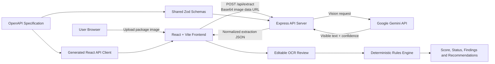
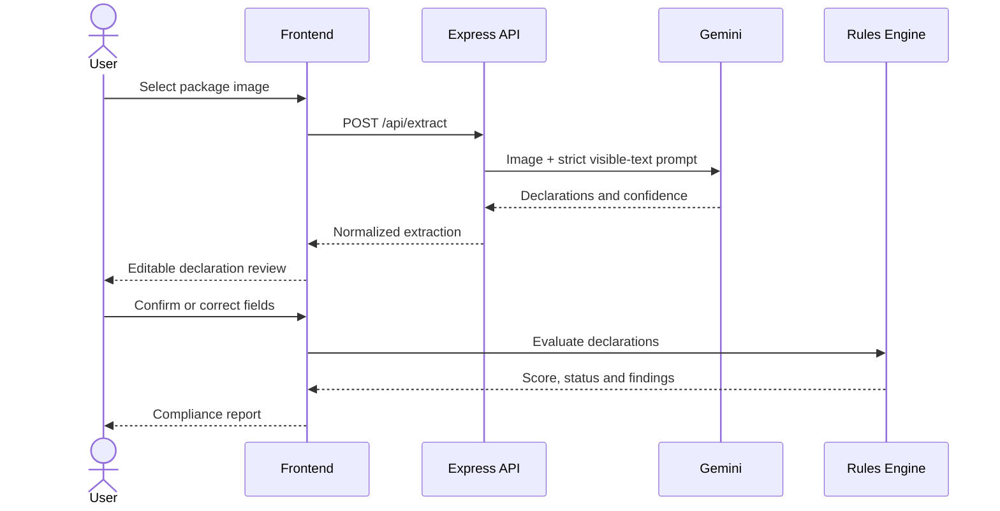

# HYPER LENS

HYPER LENS is an AI-assisted Legal Metrology package-compliance system. A user uploads a consumer-package image, Gemini extracts only visible declarations, the user can review and correct the OCR result, and a deterministic rules engine calculates compliance status and recommendations.

## Core capabilities

- Package image upload and preview
- Gemini-based visible-text extraction
- Confidence values for extracted declarations
- Editable OCR review before scoring
- Deterministic Legal Metrology checks
- Unified compliance score and status
- Field-level explanations and recommendations
- Demo package scenarios using the same rules engine

## Architecture



### Request flow



## Repository structure

```text
hyper-lens/
├── artifacts/
│   ├── hyper-lens/          # React/Vite frontend and deterministic rules engine
│   └── api-server/          # Express backend and Gemini extraction endpoint
├── lib/
│   ├── api-spec/            # OpenAPI source of truth
│   ├── api-client-react/    # Generated React Query client
│   ├── api-zod/             # Shared request/response schemas
│   └── db/                  # Shared workspace database package
├── .env.example             # Variable reference; no real secrets
├── pnpm-workspace.yaml      # Workspace and dependency catalog
├── pnpm-lock.yaml           # Reproducible dependency versions
└── README.md
```

## Technology stack

### Frontend

- React 19
- TypeScript
- Vite
- Tailwind CSS
- TanStack Query
- Wouter
- Framer Motion

### Backend

- Node.js
- TypeScript
- Express 5
- Zod validation
- Pino logging
- Gemini `generateContent` vision API

## Prerequisites

- Node.js 20 or newer
- pnpm 10 or newer
- A Gemini API key with access to a compatible vision model

## Environment configuration

This repository contains `.env.example` templates only. Actual API keys are intentionally excluded for security.

### Frontend

Copy:

```bash
cp artifacts/hyper-lens/.env.example artifacts/hyper-lens/.env
```

Variables:

| Variable | Required | Example | Purpose |
|---|---:|---|---|
| `PORT` | Yes | `5173` | Frontend development-server port |
| `BASE_PATH` | Yes | `/` | URL prefix used by Vite and frontend routing |

### Backend

Copy:

```bash
cp artifacts/api-server/.env.example artifacts/api-server/.env
```

Variables:

| Variable | Required | Example | Purpose |
|---|---:|---|---|
| `PORT` | Yes | `8080` | Express server port |
| `GEMINI_API_KEY` | Yes | `replace_with_your_gemini_api_key` | Gemini package-image extraction |
| `NODE_ENV` | No | `development` | Runtime mode |
| `LOG_LEVEL` | No | `info` | Pino logging level |

Never commit `.env` files or real credentials. The included `.gitignore` blocks them.

## Installation

From the repository root:

```bash
pnpm install
```

If the OpenAPI schema changes, regenerate the client and Zod schemas:

```bash
pnpm --filter @workspace/api-spec run codegen
```

## Run locally

The current Vite and API configurations read environment values from the shell. Open two terminals.

### Terminal 1 — backend

macOS/Linux:

```bash
set -a
source artifacts/api-server/.env
set +a
pnpm --filter @workspace/api-server run dev
```

PowerShell:

```powershell
$env:PORT="8080"
$env:NODE_ENV="development"
$env:LOG_LEVEL="info"
$env:GEMINI_API_KEY="YOUR_REAL_KEY"
pnpm --filter @workspace/api-server run dev
```

Health check:

```bash
curl http://localhost:8080/api/healthz
```

Expected response:

```json
{"status":"ok"}
```

### Terminal 2 — frontend

macOS/Linux:

```bash
set -a
source artifacts/hyper-lens/.env
set +a
pnpm --filter @workspace/hyper-lens run dev
```

PowerShell:

```powershell
$env:PORT="5173"
$env:BASE_PATH="/"
pnpm --filter @workspace/hyper-lens run dev
```

Open `http://localhost:5173/`.

> The generated frontend API client uses same-origin `/api` requests. In local development, route `/api` to the backend with a reverse proxy, or serve both applications behind the same host. Replit artifact routing already handles this arrangement.

## Run on Replit

1. Import the GitHub repository into Replit.
2. Add `GEMINI_API_KEY` through **Tools → Secrets**.
3. Do not paste the key into source files or commit it.
4. Configure the API service with `PORT=8080`.
5. Configure the frontend with its assigned `PORT` and `BASE_PATH=/`.
6. Start the API and frontend workflows.

## API reference

### Health check

```http
GET /api/healthz
```

### Extract package declarations

```http
POST /api/extract
Content-Type: application/json
```

Request:

```json
{
  "imageDataUrl": "data:image/jpeg;base64,..."
}
```

The API accepts JPEG, PNG, and WebP data URLs. The request body limit is 15 MB.

Response shape:

```json
{
  "productName": "Example Product",
  "declarations": {
    "net_quantity": { "value": "500 g", "confidence": 0.98 },
    "mrp": { "value": "₹120", "confidence": 0.95 },
    "manufacturer": { "value": "Example Manufacturer", "confidence": 0.91 }
  }
}
```

The exact contract is defined in `lib/api-spec/openapi.yaml`.

## Compliance design

Gemini is used only to read visible package text and report confidence. It does not decide legal compliance. Compliance decisions, applicability, scores, statuses, explanations, and recommendations are calculated by deterministic frontend code so the same declarations always produce the same result.

Low-confidence or missing OCR values remain reviewable instead of being silently treated as valid declarations.

## Validation and builds

Type-check the complete workspace:

```bash
pnpm run typecheck
```

Build everything:

```bash
pnpm run build
```

Build applications separately:

```bash
pnpm --filter @workspace/api-server run build
pnpm --filter @workspace/hyper-lens run build
```

## Security notes

- Never commit `GEMINI_API_KEY` or any `.env` file.
- Keep Gemini calls on the backend; never expose the key to browser code.
- The API validates request bodies with shared Zod schemas.
- Extraction prompts instruct Gemini not to invent declarations.
- Uploaded image payloads are processed in memory and are not persisted by this implementation.
- Review applicable Legal Metrology rules with a qualified professional before production or enforcement use.

## GitHub upload

```bash
git init
git add .
git commit -m "Initial HYPER LENS full-stack application"
git branch -M main
git remote add origin https://github.com/YOUR_USERNAME/hyper-lens.git
git push -u origin main
```

## License

The workspace package metadata uses the MIT license. Add a `LICENSE` file before public distribution if needed.
